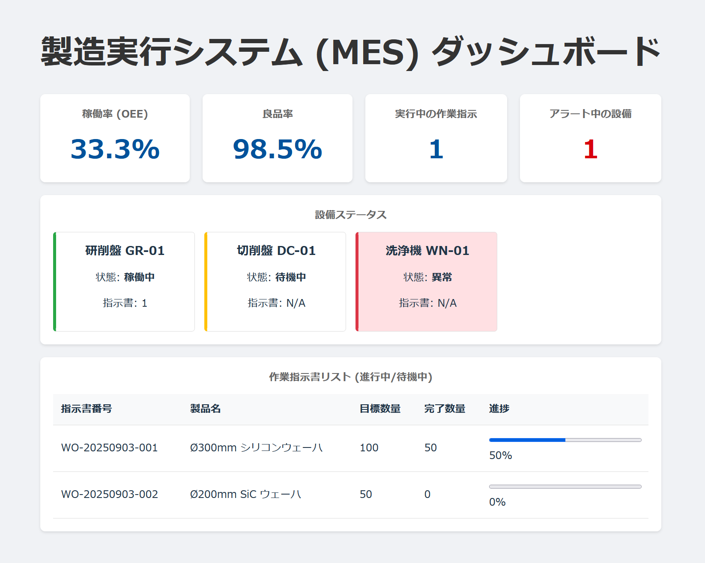
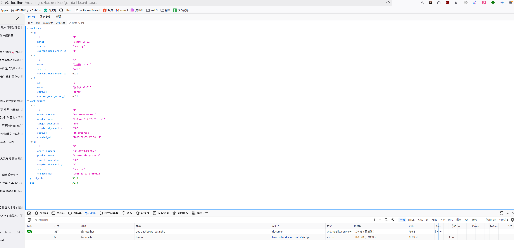

# 製造執行系統 (MES) 儀表板 Demo

這是一個為了展示 Web 全端開發能力的組合作品，模擬一個半導體製造業的生產線儀表板。

## 📸 專案截圖

### 主要畫面

用來顯示資料庫中的資料狀態


### 資料庫中的資料



## ✨ 主要功能

* **📈 數據儀表板 (Dashboard):** 即時顯示產線關鍵指標，如稼動率 (OEE)、良品率等。
* **🏭 設備狀態監控 (Machine Status Monitoring):** 以不同顏色區塊顯示各機台的即時狀態（稼働中、待機中、異常）。
* **📊 作業指示書追蹤 (Work Order Tracking):** 列表顯示進行中與待處理的工單，並以進度條呈現生產進度。
* **📡 前後端分離架構:** 前端 (Vue.js) 與後端 (PHP API) 分離，透過 API 進行數據交換。

## 🛠️ 技術棧 (Technology Stack)

* **前端 (Frontend):**
    * [Vue.js 3](https://vuejs.org/) (with Vite)
    * [Axios](https://axios-http.com/) (for API requests)
    * JavaScript (ES6+)
    * HTML5 & CSS3

* **後端 (Backend):**
    * [PHP 8](https://www.php.net/)
    * [MySQL](https://www.mysql.com/) (via XAMPP with MariaDB)
    * Apache Web Server

## 🚀 本地環境啟動指南 (Local Setup)

本專案尚未部署至公開伺服器，請依循以下步驟在本地環境啟動。

### 1. 環境準備 (Prerequisites)

請確保您的電腦已安裝以下軟體：
* [Git](https://git-scm.com/)
* [Node.js](https://nodejs.org/) (v16 或以上)
* [XAMPP](https://www.apachefriends.org/index.html) (或任何其他包含 Apache, MySQL, PHP 的本地伺服器環境)

### 2. 後端設定 (Backend Setup)

1.  **Clone 專案庫:**
    ```bash
    git clone [https://github.com/](https://github.com/)[您的Github帳號]/[您的專案庫名稱].git
    ```

2.  **移動後端專案:**
    將 `backend` 資料夾所在的**整個專案根目錄** (例如 `disco_mes_project`) 移動到您的 XAMPP 安裝路徑下的 `htdocs` 資料夾中。
    * 正確路徑應類似： `C:\xampp\htdocs\disco_mes_project\`

3.  **啟動伺服器與資料庫:**
    打開 XAMPP Control Panel，啟動 **Apache** 和 **MySQL**。

4.  **建立與匯入資料庫:**
    * 打開瀏覽器，進入 `http://localhost/phpmyadmin`。
    * 建立一個新的資料庫，名稱為 `mes_db`，並選擇 `utf8mb4_unicode_ci` 編碼。
    * 點擊您剛剛建立的 `mes_db` 資料庫，選擇 **SQL** 標籤，將下方的 SQL 腳本貼上並執行，以建立資料表與範例資料。

    <details>
    <summary>點此展開 SQL 腳本</summary>
    
    ```sql
    CREATE TABLE `machines` (
      `id` int(11) NOT NULL AUTO_INCREMENT,
      `name` varchar(100) COLLATE utf8mb4_unicode_ci NOT NULL COMMENT '機台名稱 (例: Dicer-01)',
      `status` enum('running','idle','error','maintenance') COLLATE utf8mb4_unicode_ci NOT NULL DEFAULT 'idle' COMMENT '狀態',
      `current_work_order_id` int(11) DEFAULT NULL COMMENT '目前執行的工單ID',
      PRIMARY KEY (`id`)
    ) ENGINE=InnoDB DEFAULT CHARSET=utf8mb4 COLLATE=utf8mb4_unicode_ci COMMENT='機台資訊表';

    CREATE TABLE `work_orders` (
      `id` int(11) NOT NULL AUTO_INCREMENT,
      `order_number` varchar(50) COLLATE utf8mb4_unicode_ci NOT NULL COMMENT '工單號碼',
      `product_name` varchar(100) COLLATE utf8mb4_unicode_ci NOT NULL COMMENT '產品名稱',
      `target_quantity` int(11) NOT NULL COMMENT '目標數量',
      `completed_quantity` int(11) NOT NULL DEFAULT 0 COMMENT '完成數量',
      `status` enum('pending','in_progress','completed') COLLATE utf8mb4_unicode_ci NOT NULL DEFAULT 'pending' COMMENT '工單狀態',
      `created_at` timestamp NOT NULL DEFAULT current_timestamp(),
      PRIMARY KEY (`id`),
      UNIQUE KEY `order_number` (`order_number`)
    ) ENGINE=InnoDB DEFAULT CHARSET=utf8mb4 COLLATE=utf8mb4_unicode_ci COMMENT='工單資訊表';

    INSERT INTO `machines` (`id`, `name`, `status`, `current_work_order_id`) VALUES
    (1, '研削盤 GR-01', 'running', 1),
    (2, '切削盤 DC-01', 'idle', NULL),
    (3, '洗浄機 WN-01', 'error', NULL);

    INSERT INTO `work_orders` (`id`, `order_number`, `product_name`, `target_quantity`, `completed_quantity`, `status`, `created_at`) VALUES
    (1, 'WO-20250903-001', 'Ø300mm シリコンウェーハ', 100, 50, 'in_progress', '2025-09-03 17:00:00'),
    (2, 'WO-20250903-002', 'Ø200mm SiC ウェーハ', 50, 0, 'pending', '2025-09-03 17:05:00'),
    (3, 'WO-20250903-003', 'パッケージ基板', 200, 200, 'completed', '2025-09-03 17:10:00');
    ```
    </details>

5.  **測試後端 API:**
    在瀏覽器中打開 `http://localhost/[您的專案資料夾名稱]/backend/api/get_dashboard_data.php`。如果能看到 JSON 數據，代表後端設定成功。

### 3. 前端設定 (Frontend Setup)

1.  **進入前端專案目錄:**
    ```bash
    cd path/to/your/project/frontend
    ```

2.  **安裝依賴套件:**
    ```bash
    npm install
    ```

3.  **啟動開發伺服器:**
    ```bash
    npm run dev
    ```

4.  **檢視成果:**
    打開瀏覽器，進入 `http://localhost:5173`，即可看到儀表板畫面。

## 📝 未來可擴充功能

* **異常回報:** 新增一個 `POST` API，讓前端可以回報機台異常狀況並寫入資料庫。
* **使用者認證:** 加入登入機制，區分不同權限的使用者。
* **數據篩選與排序:** 在工單列表中加入日期篩選或排序功能。

## 👤 作者

* **[Titus]**
* **[s97333333@gmail.com**
